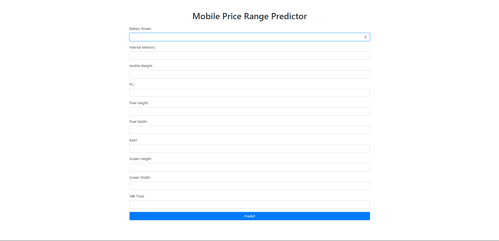
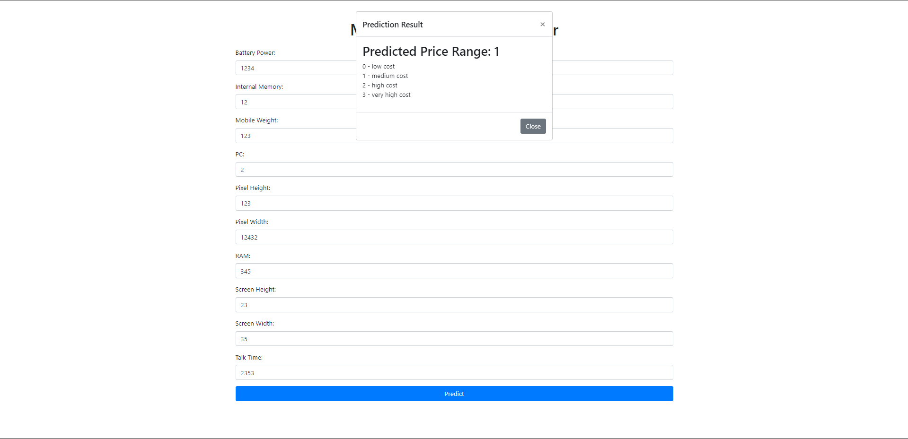

# Mobile Price Range Predictor

Welcome to the Mobile Price Range Predictor project! This project aims to help Bob, a new mobile company owner, predict the price range of mobile phones based on various features. By using machine learning models, we provide a solution to estimate price ranges, enabling Bob to compete in the highly competitive mobile phone market.

## Project Overview

Bob's mobile company wants to challenge industry giants like Apple and Samsung. However, estimating the price of new mobile phones is challenging. To address this, we use historical sales data from various companies, focusing on relationships between mobile features (e.g., RAM, Internal Memory) and selling price. Our goal is to predict price ranges, not exact prices, indicating whether the price is low, medium, high, or very high.

## Dataset Details

The dataset contains several features of mobile phones that can influence their price. Here are the key features:

- **battery_power**: Total energy a battery can store in one time measured in mAh
- **blue**: Bluetooth availability (Yes/No)
- **clock_speed**: Speed at which microprocessor executes instructions
- **dual_sim**: Dual SIM support (Yes/No)
- **fc**: Front Camera megapixels
- **four_g**: 4G support (Yes/No)
- **int_memory**: Internal Memory in Gigabytes
- **m_dep**: Mobile Depth in cm
- **mobile_wt**: Weight of mobile phone
- **n_cores**: Number of cores of processor
- **pc**: Primary Camera megapixels
- **px_height**: Screen Pixel Resolution height in pixels
- **px_width**: Screen Pixel Resolution width in pixels
- **ram**: RAM size in MB
- **sc_h**: Screen height in cm
- **sc_w**: Screen width in cm
- **talk_time**: Longest time that a single battery charge will last during a call
- **three_g**: 3G support (Yes/No)
- **touch_screen**: Touchscreen availability (Yes/No)
- **wifi**: Wi-Fi support (Yes/No)
- **price_range**: Target variable (0 - low cost, 1 - medium cost, 2 - high cost, 3 - very high cost)

## Exploratory Data Analysis (EDA) and Feature Engineering

To gain insights from the data, I have performed EDA and feature engineering. It helps me to identify and select best correlated features to improve the model's performance. Visualizations and statistical analysis were used to understand relationships and distributions of the data.

## Model Training

Since this is a multi-class classification problem, I have evaluated several classification models:

1. **Support Vector Classifier (SVC)**
2. **Random Forest Classifier**
3. **Decision Tree Classifier**
4. **Logistic Regression**

The results of the models were as follows:

| Model                     | Accuracy | Precision | Recall | F1-Score |
|---------------------------|----------|-----------|--------|----------|
| Support Vector Classifier | 0.9675   | 0.968051  | 0.9675 | 0.967639 |
| Random Forest             | 0.8850   | 0.883693  | 0.8850 | 0.884088 |
| Decision Tree             | 0.8400   | 0.839596  | 0.8400 | 0.839787 |
| Logistic Regression       | 0.6525   | 0.649673  | 0.6525 | 0.650905 |

The Support Vector Classifier (SVC) demonstrated the highest accuracy among the models.

## Hyperparameter Tuning

To fine-tune our models, I have used GridSearchCV, focusing on optimizing the parameters for each model. For this implementation, I have used pipeline from scikit-learn. After tuning, Logistic Regression achieved the best performance:

- **Best parameters**: `{'classifier': LogisticRegression(), 'classifier__C': 1, 'classifier__penalty': 'l1', 'classifier__solver': 'saga'}`
- **Best cross-validation score**: 0.974375
- **Test set accuracy with best model**: 0.975

## Web Interface

To make the model accessible for real-world use, I have created a simple web interface with the mode integrated. This interface allows users to input mobile features and predict the price range in real time.

## Getting Started

To run this project locally:

1. Clone the repository:
    ```bash
    git clone https://github.com/yourusername/mobile-price-range-predictor.git
    ```
2. Set Up a Virtual Environment (Optional but Recommended):

    It's a good practice to use a virtual environment to manage dependencies for your project, avoiding conflicts with other projects.

    I have used Python 3.10

2. Install the required dependencies:
    ```bash
    pip install -r requirements.txt
    ```
3. Run the Flask application:
    ```bash
    python app.py
    ```
4. Access the web interface at `http://localhost:5000`.

Screenshots





## Contributing

We welcome contributions to improve this project. Please feel free to submit a pull request or raise an issue.

## License

This project is licensed under the MIT License.

---

Thank you for checking out the Mobile Price Range Predictor project! If you have any questions or feedback, please feel free to reach out.

